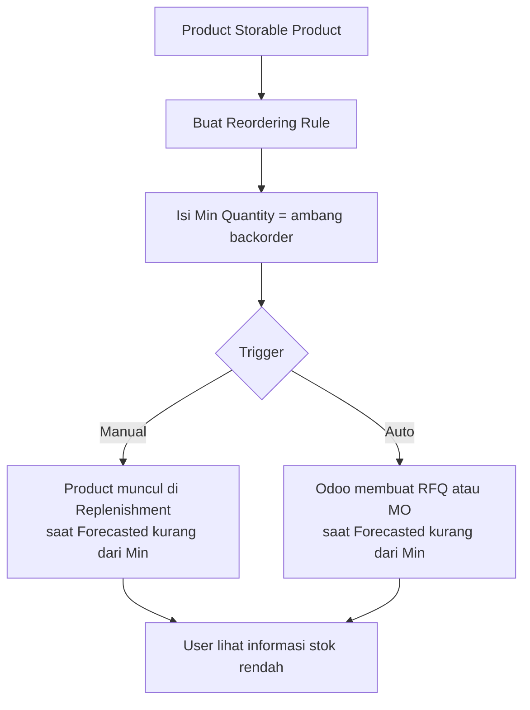

# Panduan Setting Backorder pada Product

**Odoo 16 Community Edition**

Tujuan: memberi informasi saat stok product lebih rendah dari quantity ambang (quantity backorder).

Untuk isi **Min Quantity + Trigger di setiap product** secara klik-per-klik, pakai
[Setting Backorder + Trigger per Product (cara tercepat)](panduan_cepat_backorder_trigger_product.md).
Dokumen ini adalah referensi lengkap.

---

## 1. Ringkasan

Odoo 16 Community **tidak punya field bernama "Backorder Quantity" di form product**. Fitur yang memenuhi tujuan di atas adalah **Reordering Rules** (Aturan Pemesanan Ulang):

| Yang Anda maksud | Field di Odoo 16 | Hasil |
| --- | --- | --- |
| Quantity backorder / ambang stok | **Min Quantity** pada Reordering Rules | Saat stok *forecasted* turun di bawah angka ini, product muncul di laporan **Replenishment** |
| Target stok setelah diisi ulang | **Max Quantity** | Jumlah yang diusulkan untuk dipesan = Max − Forecasted |
| Hanya informasi, belum otomatis beli | **Trigger = Manual** | Product tampil sebagai kebutuhan; user yang memutuskan kapan order |
| Otomatis buat RFQ / Manufacturing Order | **Trigger = Auto** | Scheduler membuat draft pembelian/produksi |

Ada fitur kedua yang juga bernama **Backorder**, tetapi artinya berbeda: sisa pengiriman atau penerimaan yang belum selesai. Itu diatur di **Operation Types**, bukan di product. Kedua fitur dijelaskan di dokumen ini.



---

## 2. Dua konsep yang sering tercampur

### 2.1 Ambang stok di product (sesuai tujuan panduan ini)

Digunakan untuk **memberi tahu** bahwa stok sudah di bawah quantity yang Anda tetapkan.

- Menu: **Inventory → Operations → Replenishment**
- Atau smart button **Reordering Rules** di form product
- Odoo membandingkan **Forecasted Quantity**, bukan hanya On Hand

Rumus stok yang dipakai Odoo:

```text
Forecasted = On Hand + Incoming − Outgoing
```

- **On Hand**: stok fisik di gudang
- **Incoming**: quantity yang masih dalam perjalanan (PO belum diterima, MO belum selesai)
- **Outgoing**: quantity yang sudah dipesan pelanggan / direservasi untuk pengiriman

Rule terpicu jika **Forecasted < Min Quantity**.

### 2.2 Backorder pengiriman / penerimaan

Digunakan saat Anda **Validate transfer dengan quantity lebih kecil dari Demand**.

Contoh: SO 10 unit, stok hanya 6. Anda kirim 6, sisa 4 menjadi backorder (dokumen transfer baru) jika setting-nya mengizinkan.

- Menu: **Inventory → Configuration → Operation Types**
- Field: **Create Backorder** = Ask / Always / Never

---

## 3. Prasyarat

1. Aplikasi **Inventory** terpasang.
2. Jika product dibeli dari vendor, pasang juga **Purchase**. Jika diproduksi, pasang **Manufacturing**.
3. Product harus bertipe **Storable Product** (Produk yang Dapat Disimpan).
   - Consumable dan Service **tidak** punya stok, jadi tidak bisa dipakai untuk ambang backorder.
4. User punya hak akses Inventory / Warehouse Manager.
5. UI di panduan ini memakai **label English** (default banyak database). Padanan Bahasa Indonesia ada di Lampiran A.

Aktifkan **Developer Mode** jika menu Configuration terasa tidak lengkap:

**Settings → Activate the developer mode** (paling bawah halaman About, atau `?debug=1` di URL).

---

## 4. Siapkan product

1. Buka **Inventory → Products → Products**.
2. Buat product baru atau buka product yang sudah ada.
3. Di bawah nama product, centang:
   - **Can be Sold** jika product dijual
   - **Can be Purchased** jika product dibeli (wajib untuk Reordering Rules rute Buy)
4. Tab **General Information**:
   - **Product Type** = `Storable Product`
   - **Unit of Measure** sesuai satuan stok (misalnya Units)
5. Tab **Inventory**:
   - Centang rute **Buy** jika diisi ulang lewat pembelian
   - Centang rute **Manufacture** jika diisi ulang lewat produksi
   - Jangan centang **Replenish on Order (MTO)** jika Anda ingin menjaga stok buffer. MTO memicu pengadaan per sales order dan **tidak** memakai Min Quantity sebagai buffer.
6. Tab **Purchase** (untuk rute Buy):
   - Tambah minimal satu **Vendor** beserta harga
7. Simpan. Di bagian atas form akan muncul smart button **On Hand**, **Forecasted**, dan **Reordering Rules**.

Tanpa vendor (rute Buy) atau Bill of Materials (rute Manufacture), Odoo tetap bisa menampilkan kebutuhan di Replenishment, tetapi tidak bisa membuat RFQ/MO. Activity peringatan akan muncul di chatter product.

---

## 5. Set quantity backorder di product (Reordering Rules)

Ini langkah inti. **Min Quantity** = quantity backorder / ambang informasi stok.

### 5.1 Dari form product (disarankan)

1. Buka product.
2. Klik smart button **Reordering Rules**.
3. Klik **Create**.
4. Isi field berikut, lalu **Save**:

| Field | Isi yang disarankan | Keterangan |
| --- | --- | --- |
| **Product** | Terisi otomatis | Product yang sedang dibuka |
| **Location** | `WH/Stock` (atau lokasi stok Anda) | Tempat stok yang diawasi |
| **Min Quantity** | Quantity backorder, misalnya `20` | Ambang. Informasi muncul jika Forecasted **lebih rendah** dari angka ini |
| **Max Quantity** | Target stok, misalnya `50` | Quantity yang diusulkan untuk dipesan = Max − Forecasted |
| **Multiple Quantity** | `0` atau kelipatan pack vendor | `0` = pesan persis sisa kebutuhan. `12` = dibulatkan ke kelipatan 12 |
| **UoM** | Sama dengan UoM stok product | Satuan pemesanan |
| **Trigger** | `Manual` untuk informasi; `Auto` untuk otomatis beli | Lihat bagian 5.3 |

Jika kolom **Trigger** tidak terlihat:

1. Buka **Inventory → Configuration → Reordering Rules** (atau **Inventory → Operations → Replenishment**).
2. Klik ikon **slider / adjust settings** di kanan header kolom.
3. Centang **Trigger**.

### 5.2 Dari menu Replenishment

1. Buka **Inventory → Operations → Replenishment**.
2. Klik **Create**.
3. Pilih **Product**, isi **Min Quantity** dan **Max Quantity**, simpan.

Cara ini praktis untuk banyak product sekaligus.

### 5.3 Pilih Trigger: Manual vs Auto

| Trigger | Kapan dipakai | Perilaku saat Forecasted &lt; Min Quantity |
| --- | --- | --- |
| **Manual** | Tujuan Anda: **informasi** stok rendah | Product tampil di dashboard Replenishment sebagai kebutuhan. Tidak ada RFQ otomatis. User klik **Order Once** jika ingin pesan. |
| **Auto** | Stok buffer yang harus selalu terisi | Scheduler (default setiap hari) membuat draft RFQ atau Manufacturing Order sampai Forecasted mencapai Max Quantity. |

Untuk tujuan “memberi informasi saat stok lebih rendah dari quantity backorder”, pakai **Trigger = Manual**.

### 5.4 Beberapa gudang / lokasi

Satu product boleh punya **lebih dari satu** Reordering Rule, masing-masing untuk lokasi berbeda. Contoh:

- `WH/Stock` — Min 20, Max 50
- `WH2/Stock` — Min 5, Max 15

Odoo menilai Forecasted **per lokasi** rule tersebut, bukan total perusahaan (kecuali lokasi yang dipilih memang mencakup anak-lokasi sesuai konfigurasi gudang).

---

## 6. Cara melihat informasi stok rendah

Setelah Min Quantity di-set, informasi muncul di beberapa tempat.

### 6.1 Dashboard Replenishment (utama)

**Inventory → Operations → Replenishment**

Tampilan default menampilkan product yang **perlu diisi ulang** (filter *To Reorder*): Forecasted lebih rendah dari Min Quantity.

Kolom penting:

| Kolom | Arti |
| --- | --- |
| **On Hand** | Stok fisik sekarang |
| **Forecasted** | On Hand + Incoming − Outgoing |
| **Min** | Quantity backorder / ambang Anda |
| **Max** | Target stok |
| **To Order** | Usulan quantity pesanan (bisa diubah manual) |
| **Vendor** | Pemasok default |

Tindakan di baris:

- **Order Once**: buat RFQ/MO sekali untuk quantity *To Order*
- **Automate Orders** (ikon panah putar): ubah trigger menjadi Auto

Ini adalah layar informasi yang diminta: daftar product yang stoknya sudah di bawah quantity backorder.

### 6.2 Smart button di form product

| Smart button | Kegunaan |
| --- | --- |
| **On Hand** | Stok per lokasi. Bisa **Update Quantity** untuk adjustment |
| **Forecasted** | Grafik/daftar Incoming vs Outgoing. Angka negatif = stok tidak cukup untuk permintaan yang sudah ada |
| **Reordering Rules** | Cek/ubah Min Quantity |

Bandingkan On Hand atau Forecasted dengan Min Quantity. Jika lebih rendah, product itu “di bawah backorder”.

### 6.3 Laporan Forecasted Inventory

**Inventory → Reporting → Forecasted Inventory**

Pakai ini untuk melihat product yang Forecasted-nya rendah atau negatif, termasuk yang belum punya Reordering Rule.

### 6.4 List product

**Inventory → Products → Products** — tampilan list.

Tambah kolom **On Hand** dan **Forecasted** lewat ikon slider di header jika belum tampil. Sortir Forecasted dari yang terkecil untuk melihat product yang paling kritis.

### 6.5 Jalankan scheduler manual (untuk Trigger Auto)

Reordering Rules Auto dijalankan scheduler harian (default sekitar tengah malam). Untuk mengetes segera:

1. Aktifkan Developer Mode.
2. **Inventory → Operations → Run Scheduler**
3. Klik **Run Scheduler**

Perintah ini juga menjalankan scheduled action lain, bukan hanya reordering.

---

## 7. Contoh angka

Product **Filter Oli**, UoM Units, lokasi `WH/Stock`.

| Parameter | Nilai |
| --- | --- |
| On Hand | 8 |
| Outgoing (SO belum dikirim) | 3 |
| Incoming (PO belum diterima) | 0 |
| **Forecasted** | 8 + 0 − 3 = **5** |
| **Min Quantity** (quantity backorder) | **20** |
| **Max Quantity** | **40** |
| Trigger | Manual |

Karena 5 &lt; 20, product muncul di **Replenishment**.

Usulan **To Order** = 40 − 5 = **35**.

Jika Multiple Quantity = 10, To Order dibulatkan menjadi **40**.

Di layar Replenishment Anda langsung melihat:

> stok forecasted 5, lebih rendah dari quantity backorder 20, perlu pesan 35.

Itu informasi yang menjadi tujuan setting ini.

---

## 8. Setting Create Backorder pada Operation Types

Bagian ini mengatur **sisa transfer**, bukan ambang stok di product.

1. Buka **Inventory → Configuration → Operation Types**.
2. Buka jenis operasi yang relevan:
   - **Delivery Orders** — pengiriman ke pelanggan
   - **Receipts** — penerimaan dari vendor
   - **Internal Transfers** — pindah antar lokasi
3. Pada field **Create Backorder**, pilih salah satu:

| Nilai | Perilaku saat Validate dengan Done &lt; Demand |
| --- | --- |
| **Ask** (default) | Popup: **Create Backorder** atau **No Backorder** |
| **Always** | Sisa quantity otomatis jadi dokumen backorder, tanpa popup |
| **Never** | Sisa quantity dibatalkan. Transfer dianggap selesai dengan quantity yang ada |

4. Simpan.

### 8.1 Alur pengiriman saat stok lebih rendah dari quantity SO

1. Buat **Sales Order** dengan quantity lebih besar dari On Hand. Confirm.
2. Odoo membuat **Delivery Order**. Status bisa *Waiting* atau *Ready* (reservasi sebagian).
3. Buka Delivery Order. Kolom **Reserved** / **Done** lebih kecil dari **Demand**.
4. Isi **Done** sesuai stok yang benar-benar dikirim, lalu **Validate**.
5. Tergantung Create Backorder:
   - **Create Backorder**: transfer baru untuk sisa quantity, referensi ke DO asli. SO berstatus pengiriman parsial.
   - **No Backorder**: sisa tidak dikirim; Demand disesuaikan.

Backorder pengiriman **memberi informasi sisa yang belum terpenuhi**, tetapi **bukan** tempat untuk mengisi angka ambang di master product. Angka ambang tetap di **Min Quantity**.

### 8.2 Penerimaan PO parsial

Sama seperti pengiriman: buka Receipt, isi Done &lt; Demand, Validate, lalu pilih apakah sisa dijadikan backorder.

---

## 9. Rekomendasi konfigurasi sesuai tujuan

Untuk “memberi informasi saat stok product lebih rendah dari quantity backorder”:

1. Product = **Storable Product**, rute **Buy** (atau Manufacture), ada Vendor/BoM.
2. Buat **Reordering Rule** per product (atau per lokasi).
3. **Min Quantity** = quantity backorder.
4. **Max Quantity** = target stok yang wajar (boleh sama dengan Min jika Anda hanya ingin sinyal, tanpa usulan naik stok besar).
5. **Trigger = Manual**.
6. Jadwalkan user gudang/purchasing membuka **Inventory → Operations → Replenishment** setiap hari.
7. Di Operation Types **Delivery Orders**, biarkan **Create Backorder = Ask** agar pengiriman parsial tetap tercatat.

Kombinasi ini memakai fitur standar Community Edition. Tidak perlu modul berbayar.

---

## 10. Checklist uji cepat

Gunakan product tes, bukan product produksi.

1. Product Storable, Can be Purchased, ada Vendor, rute Buy.
2. On Hand di-set ke `8` lewat **Update Quantity**.
3. Reordering Rule: Location `WH/Stock`, Min `20`, Max `40`, Trigger **Manual**.
4. Buka **Inventory → Operations → Replenishment**.
5. Product tes harus tampil, Forecasted sekitar 8, To Order sekitar 32.
6. (Opsional) Buat SO quantity `10`, Confirm. Forecasted turun; Replenishment tetap menampilkan kebutuhan yang lebih besar.
7. (Opsional) Ubah Operation Type Delivery Orders ke **Ask**. Kirim sebagian, Validate, pastikan popup backorder muncul.

Jika product tidak muncul di Replenishment:

- Cek Product Type bukan Consumable/Service
- Cek Location rule sama dengan lokasi stok
- Cek Forecasted **sudah** di bawah Min (Incoming PO yang besar bisa membuat Forecasted ≥ Min)
- Refresh / hapus filter selain *To Reorder*
- Cek rule tidak di-archive

---

## 11. Troubleshooting

| Gejala | Penyebab umum | Perbaikan |
| --- | --- | --- |
| Tidak ada smart button Reordering Rules | Product Type bukan Storable | Ubah ke Storable Product, simpan ulang |
| Replenishment kosong padahal stok rendah | Belum ada rule, atau Forecasted masih ≥ Min karena ada Incoming | Buat rule; cek Forecasted di product |
| RFQ tidak terbuat (Trigger Auto) | Tidak ada Vendor, atau rute Buy tidak aktif | Isi vendor di tab Purchase; centang Buy |
| Activity error di chatter product | Konfigurasi rute/vendor/BoM tidak lengkap | Ikuti teks activity; lengkapi master data |
| Stok On Hand 0 tetapi Forecasted masih tinggi | Ada Incoming PO/MO | Buka smart button Forecasted, cek baris incoming |
| Backorder tidak muncul saat Validate DO | Create Backorder = Never, atau Done sudah sama dengan Demand | Ubah Operation Type; pastikan Done &lt; Demand |
| MTO membuat PO setiap SO, Min Quantity diabaikan | Rute Replenish on Order (MTO) aktif | Matikan MTO jika ingin buffer stok |

---

## Lampiran A. Padanan menu Bahasa Indonesia

| English (panduan ini) | id_ID (Odoo 16) |
| --- | --- |
| Inventory | Inventaris |
| Products | Produk |
| Configuration | Konfigurasi |
| Operation Types | Jenis Operasi |
| Reordering Rules | Aturan Pemesanan Ulang |
| Replenishment | Pengisian Ulang |
| Run Scheduler | Jalankan Penjadwal |
| Forecasted Inventory | Inventaris yang Diperkirakan |
| Storable Product | Produk yang Dapat Disimpan |
| Can be Purchased | Dapat Dibeli |
| Min Quantity | Kuantitas Min. |
| Max Quantity | Kuantitas Maks. |
| Trigger | Pemicu |
| Create Backorder | Buat Backorder |
| Ask / Always / Never | Tanyakan / Selalu / Tidak Pernah |
| On Hand | Tersedia |
| Forecasted | Diperkirakan |
| Delivery Orders | Pesanan Pengiriman |
| Receipts | Penerimaan |
| Validate | Validasi |
| No Backorder | Tidak Ada Backorder |

---

## Lampiran B. Yang tidak tersedia di Community Edition

Fitur berikut **ada di Odoo 16 Community** dan dipakai panduan ini:

- Reordering Rules, Replenishment, Run Scheduler
- Create Backorder pada Operation Types
- Forecasted quantity, laporan Forecasted Inventory
- Rute Buy / Manufacture / MTO

Fitur yang **hanya Enterprise** (tidak diperlukan di sini): Barcode (lisensi Enterprise pada beberapa paket), Advanced replenishment reporting tertentu, dan modul Inventory yang berbayar. Alur di atas lengkap tanpa Enterprise.

---

## Referensi resmi

- [Configure reordering rules — Odoo 16.0](https://www.odoo.com/documentation/16.0/applications/inventory_and_mrp/purchase/products/reordering.html)
- [Reordering rules — Odoo 16.3+](https://www.odoo.com/documentation/saas-16.3/applications/inventory_and_mrp/inventory/product_management/product_replenishment/reordering_rules.html)
